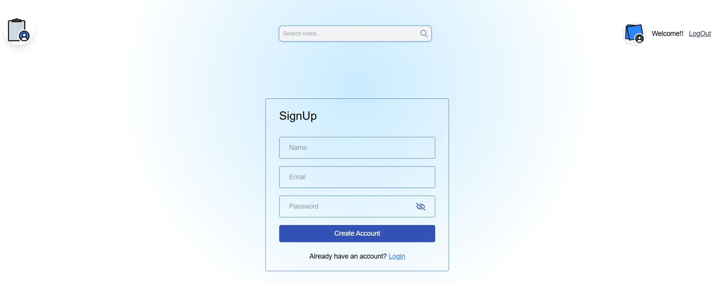

# **Full Stack Implementation Exercise**


## **Description**
The purpose of this project is to showcase both backend and frontend skills by developing an application that allows users to create and modify notes. The application includes features such as note filtering. The backend is built using Node.js and MongoDB, while the frontend utilizes the React framework.

## **Prerequisites**

### **1. Runtimes and Engines**
- **Node.js**: `v20.16.0`
- **NPM**: `v10.8.1` (Included with Node.js)
- **Tailwindcss**: `v3.4.9` (Included with Node.js)
- **Vite**: `v5.4.0` (If needed)
- **React**: `v18.3.1`
- **Axios**: `v1.7.3`
- **Mongoose**: `v8.5.2` (For MongoDB, if applicable)

### **2. Tools and Dependencies**
- **Git**: `v2.43.0.`
- **VSCode**: `v1.92.1`


## **Installation**

### **1. Clone the Repository**
```bash
git clone [https://github.com/username/project.git](https://github.com/ensolvers-github-challenges/BernalCuaspa-bc2231.git)
cd project
```
### **2. Add execute permissions and Run**
```bash
chmod +x start.sh
./start.sh
```

## **Documentation**
For the backend implementation, MongoDB was used to create a database that stores both users and notes. This database enables user authentication and registration, as well as reading and modifying notes.


In the backend folder, you will find the config.json file, which contains the database URL required for establishing the connection.

```bash
{
    "connectionString": "mongodb+srv://xxxxxxxxxxxx"
}
```

In the .env file, you will find a randomly generated token required for authentication and other API access.

```bash
{
    ACCESS_TOKEN_SECRET= xxxxxxyyyyyyyxxxx
}
```

### API Methods

The application provides the following API methods:

1. **GET**: Retrieves notes and user information with their respective details.
2. **POST**: Allows users to register, log in, and create new notes.
3. **PUT**: Updates existing notes.
4. **DELETE**: Deletes notes.


### Frontend React
For the frontend, the application utilizes the React framework in conjunction with Tailwind CSS for styling. Below are the required installations:

Once the dependencies are specified in package.json, you only need to install them on your local machine.

### **Installations**
```bash
npm install
```

## Use App

### **1. Login Page**
On the Login page, you will find the form to access the application. If you don’t have an account yet, you can register by clicking the "Login" button.
You can use email:o@gmail.com password:123


### **2. SignUp Page**
On the registration page, you can complete the form to create an account and gain access to the website.


### **3. Home Page**
Once logged in, you will be directed to the home page. Here, you will see a prompt if you don't have any notes yet, guiding you to add a new note using the button located at the bottom right.


### **4. Add Note**
After clicking the "Add Note" button, you will need to fill out the required fields and optionally add a tag to your note.


### **5. Notes**
Once you have added as many notes as you like, you can view them all. You can also edit a note by clicking the pencil icon, delete it using the trash can icon, or archive it with the archive icon. Archived notes will be distinguished from the others.


### **6. Search Note**
If you want to search for a specific note, you can use the search bar to filter it.


### **7. LogOut**
Once you have organized and managed your notes, you can log out of the website.


## Contact

If you need more information about this project or my work as a software developer, feel free to reach out through the following social media channels.
- **Email**: Send us your inquiries or support requests at [ljndrsebastian@gmail.com](mailto:ljndrsebastian@gmail.com).
- **LinkedIn**: Find me on my linkedin to stay in touch [Sebastian Bernal](https://www.linkedin.com/in/sebastian-bernal-096569253/).
- **Website**: Visit my official page for more information: [Sebastian Bernal](https://app-briefcase-astro.vercel.app/).
- **GitHub**: Visit my repositories: [Sebastian Bernal](https://github.com/sebastianbernalc).


